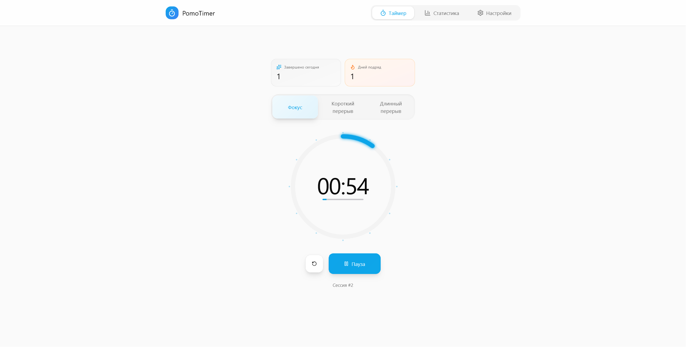
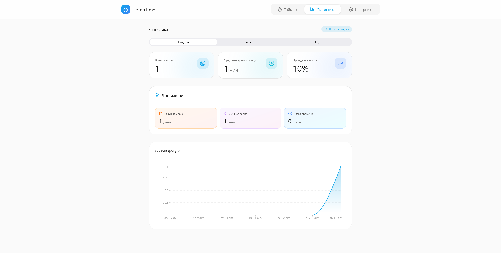
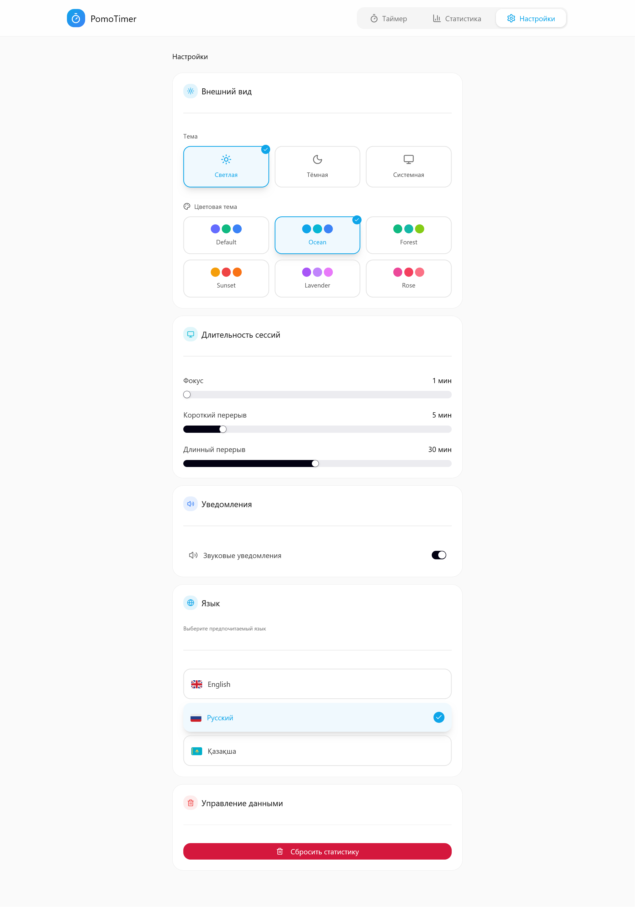

# PomoTimer

**PomoTimer** — современный Pomodoro таймер на **React + TypeScript + Redux Toolkit + TailwindCSS** с сохранением состояния в `localStorage`.  

**Pet-проект** для GitHub, демонстрирующий навыки фронтенд-разработки: React, Redux Toolkit, Hooks, Tailwind, TypeScript, UI/UX, Sonner, Framer Motion, Radix UI и best practices.

---

## Особенности

### Pomodoro-таймер с тремя фазами
- Focus, Short Break и Long Break — каждая фаза гибко настраивается пользователем.

### Сохранение состояния в localStorage
- Все данные (время, настройки, статистика, текущая фаза) сохраняются и восстанавливаются после перезагрузки страницы.

### Гибкие настройки
- Настройка длительности каждой фазы.  
- Включение или отключение звука.  
- Выбор языка интерфейса (en / ru / kk).  
- Выбор цветовой темы и режима (светлая / тёмная).

### Мультиязычность
- Поддержка трёх языков: English, Русский, Қазақша.  
- Интерфейс автоматически обновляется при смене языка.

### Динамические цветовые темы
- Используются палитры primary, secondary, accent.  
- Цвета адаптируются под выбранный режим (light / dark).

### Поддержка системной темы
- Автоматическое определение и применение темы устройства.

### Подробная статистика
- Подсчёт завершённых сессий.  
- Ежедневная статистика и отображение прогресса.  
- Поддержка стрика (серии дней подряд с фокусом).

### Эффекты и анимации
- Плавные переходы с использованием Framer Motion.  
- Конфетти-анимация при завершении фокус-сессии.

### Уведомления
- Уведомления о завершении фазы реализованы через библиотеку Sonner.  
- Включают краткий текст и визуальный отклик.

### Redux Toolkit и хуки
- Централизованное управление состоянием через Redux Toolkit.  
- Используются типизированные хуки useAppSelector и useAppDispatch.

### Модульная архитектура компонентов
- Компоненты разделены по функциональности (TimerCircle, PhaseSelector, TimerControls, SessionStats и др.).  
- Каждый модуль отвечает за отдельный аспект логики или интерфейса.

### Автоматическое восстановление состояния
- При обновлении страницы таймер продолжает работу с текущего времени и фазы.

### Звуковое уведомление
- Реализовано через Web Audio API, без использования сторонних библиотек.

### Адаптивный интерфейс
- Оптимизирован под мобильные устройства, планшеты и десктопы.  
- Гибкая верстка на TailwindCSS.

### Современный и лаконичный UI
- Основан на TailwindCSS и Radix UI.  
- Минималистичный дизайн с фокусом на удобстве и UX.

---

## Стек технологий

- **React 18 + TypeScript** — современный фронтенд
- **Vite + SWC** — быстрая сборка и компиляция
- **Redux Toolkit** — управление состоянием
- **TailwindCSS** — стилизация и responsive design
- **LocalStorage** — сохранение прогресса таймера
- **Framer Motion** — анимации интерфейса
- **Sonner** — уведомления
- **Radix UI** — доступные и настраиваемые UI-компоненты
- и многое другое...

---

## Скриншоты

Home Page:


Stats Page:


Settings Page:


## Установка и запуск

```bash
# Клонируем репозиторий
git clone https://github.com/TeGaLeX15/pomotimer.git
cd pomotimer

# Устанавливаем зависимости
npm install

# Запуск в режиме разработки
npm run dev

# Сборка проекта для продакшена
npm run build

# Локальный просмотр собранной версии
npm run preview
```

---

## Контакты

Автор: **Artem Gart**  
GitHub: [https://github.com/TeGaLeX15](https://github.com/TeGaLeX15)  
Email: gartartem1505@gmail.com
