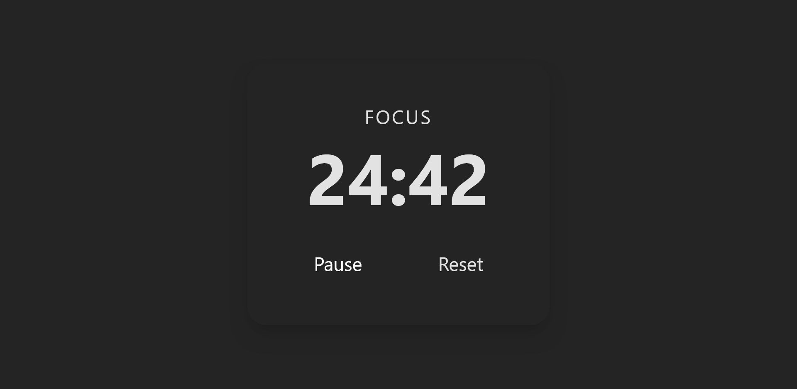

# PomoTimer

**PomoTimer** — современный Pomodoro таймер на **React + TypeScript + Redux Toolkit + TailwindCSS** с сохранением состояния в `localStorage`.  

**Pet-проект** для GitHub, демонстрирующий навыки фронтенд-разработки: React, Redux Toolkit, hooks, Tailwind, TypeScript и best practices.

---

## Особенности

- Start / Pause / Reset таймер  
- Рабочая (Focus) и короткая пауза (Break) фазы
- Состояние таймера сохраняется в `localStorage`
- React + TypeScript + Redux Toolkit
- Хуки для управления таймером (`useTimer`)
- TailwindCSS для адаптивной и чистой стилизации

---

## Стек технологий

- **React 18 + TypeScript** — современный фронтенд
- **Vite + SWC** — быстрая сборка и компиляция
- **Redux Toolkit** — управление состоянием
- **TailwindCSS** — стилизация и responsive design
- **LocalStorage** — сохранение прогресса таймера
- и многое другое...

---

## Скриншоты

Timer working:


Timer paused:


Reset state:


## Установка и запуск

```bash
# Клонируем репозиторий
git clone https://github.com/TeGaLeX15/pomotimer.git
cd pomotimer

# Устанавливаем зависимости
npm install

# Запуск в режиме разработки
npm run dev

# Сборка проекта для продакшена
npm run build

# Локальный просмотр собранной версии
npm run preview
```

---

## Контакты

Автор: **Artem Gart**  
GitHub: [https://github.com/TeGaLeX15](https://github.com/TeGaLeX15)  
Email: gartartem1505@gmail.com
